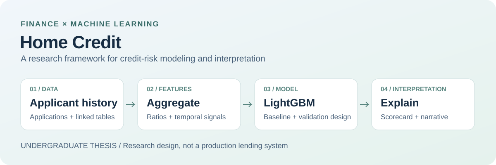

# Home Credit risk modeling

**Undergraduate thesis · Financial risk · Machine learning**

[← Back to my profile](./README.md)

My undergraduate thesis explored how a credit-risk model could combine information from multiple borrower-history tables and make its output easier to interpret. The research connects my finance background with feature engineering, model evaluation, and AI-assisted reporting.

This is a research case study. It is not a deployed lending product, a current benchmark, or a claim of affiliation with Home Credit.

## The problem

An application record captures only part of a borrower's history. The Home Credit dataset links applications to bureau records, previous applications, balances, and repayment history. Those tables represent different units: an applicant, a loan, or a monthly event. Combining them requires an explicit aggregation strategy before applicant-level modeling.

The question in my thesis was how to turn that relational history into useful risk features, then explain the model's output in a form someone could review.

## Research design

*Conceptual illustration of the thesis framework, not a trace of a verified end-to-end run.*

The thesis brought together four areas:

- **Data preparation:** inspect missingness, anomalies, and relationships across the application and history tables.
- **Feature engineering:** combine financial ratios with applicant-level aggregates and temporal summaries of historical behavior.
- **Model evaluation:** compare LightGBM with a logistic-regression baseline; discuss stratified validation, class imbalance, ranking metrics, and calibration.
- **Interpretation:** explore scorecard conversion, feature-attribution explanations, and structured natural-language reports. The generative model is an interpretation layer, not the predictive model itself.

## What the public case study establishes

The thesis manuscripts and surviving scripts support the research scope and design described above. The archive also contains exploratory processing and partial experiment logs.

However, the narrative metrics, embedded figures, and surviving run logs do not yet form a reconciled, reproducible benchmark. Some plotting scripts use illustrative data, and the archived training implementation is incomplete. For that reason, this page intentionally omits numerical performance and approval-rate claims. It does not present any archived illustration as measured model performance.

This distinction matters: a proposed workflow, a thesis-reported result, and a rerunnable experiment are different forms of evidence.

## Requirements for a reproducible release

Before publishing a benchmark or reusable implementation, the release would need:

1. A complete training entry point and pinned dependencies.
2. Documented data access, feature definitions, train/validation/test boundaries, and preprocessing fitted only within the appropriate training partition.
3. Saved predictions and run metadata tied to the exact evaluation split.
4. All evaluation figures regenerated from those predictions, with numerical discrepancies resolved.
5. A separate accounting of any simulated threshold or business-value scenario.

The current portfolio release includes this written case study and an original conceptual diagram. It does not redistribute borrower records, competition data, model artifacts, or the original thesis files.

## Sources and scope

- [Home Credit Default Risk on Kaggle](https://www.kaggle.com/competitions/home-credit-default-risk): original dataset context and access route. Consult the competition's current terms before using or redistributing its materials.
- Author's undergraduate thesis, *A LightGBM and Generative AI-Based Framework for Personal Credit Default Risk Assessment*, and its Chinese-language manuscript, 2025. Original files are retained privately.
- The author's local source archive, reviewed for this case study. No new training run is claimed.

Historical benchmark data does not establish suitability for current lending decisions. This case study makes no claim of production deployment, regulatory compliance, realized financial impact, or autonomous credit approval.
