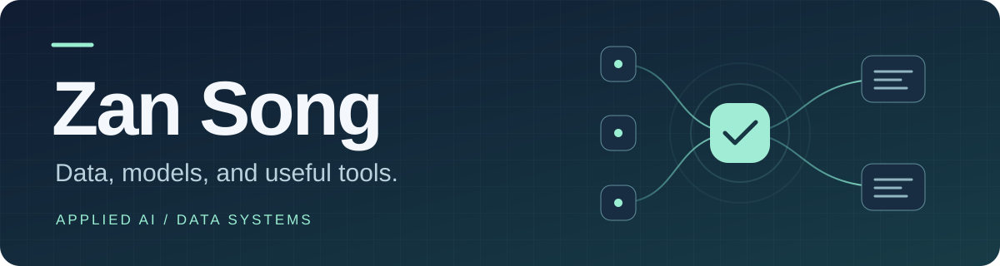

<picture>
  <source media="(max-width: 600px)" srcset="./profile-banner-mobile.svg">
  
</picture>

**I build data pipelines and AI tools for healthcare, risk, and everyday workflows.**

My work connects healthcare data, financial risk, and workflows people can inspect. I work on analytics and AI workflows with **UCLA Digital & Technology Solutions**, and study **Data Science in Health at UCLA** and **Computer Science at Georgia Tech**.

**[Visit my portfolio →](https://zan-song.zansong.chatgpt.site/)** — project stories and a no-setup synthetic demo.

[Featured](#selected-work) · [Projects](#more-work) · [Notes](#engineering-notes) · [About](./EXPERIENCE.md)

## Selected work

### ProviderGraph RiskGuard · Featured

**What changed in a provider directory—and what evidence supports it?** ProviderGraph turns versioned public-source snapshots into investigation timelines an analyst can inspect.

My focus is the investigation workflow, evidence requirements, and evaluation scenarios, developed with AI assistance. Three design choices shape the system:

- **Keep the history:** versioned snapshots and source references make changes traceable.
- **Bound the agent:** the local model can propose a tool; deterministic policy controls execution.
- **Make uncertainty visible:** unresolved evidence gaps stop at human review.

`Python` `DuckDB` `FastAPI` `React`

**[Try the browser demo →](https://zan-song.zansong.chatgpt.site/demo/)** — compare three synthetic snapshot pairs, inspect evidence, and record a sample review. Browser-only illustration: no Python agent execution, live model calls, or real provider verification.

[Explore the code →](https://github.com/ZanSong-AI/providergraph-riskguard) · [Run the offline demo](https://github.com/ZanSong-AI/providergraph-riskguard/blob/main/docs/DEMO_RUNBOOK.md) · [Architecture](https://github.com/ZanSong-AI/providergraph-riskguard/blob/main/docs/ARCHITECTURE.md) · [Evaluation & limits](https://github.com/ZanSong-AI/providergraph-riskguard/blob/main/docs/AGENTBENCH.md)

*Synthetic demo; analyst review required. Not a medical or autonomous insurance decision system.*

Watch the 19-second walkthrough

Silent loop from the controlled offline demo. Close this section to hide the animation. [Open the static screenshot instead](https://raw.githubusercontent.com/ZanSong-AI/providergraph-riskguard/main/docs/assets/watchtower-agent-demo.png).

## More work

### Creator Commerce Governance Agent

**Multimodal evidence, from source to review.** Connects policy-source snapshots with OCR/ASR analysis of synthetic promotional media and a human-reviewed audit trail.

**Engineering focus:** immutable sources, media-processing jobs, and database-backed approval gates. A requirement cannot activate a control before human approval.

`Python` `PostgreSQL` `FastAPI` `React`

[Explore the code →](https://github.com/ZanSong-AI/creator-commerce-governance-agent) · [Demo guide](https://github.com/ZanSong-AI/creator-commerce-governance-agent/blob/main/docs/DEMO_GUIDE.md) · [Evaluation](https://github.com/ZanSong-AI/creator-commerce-governance-agent/blob/main/reports/EVALUATION_REPORT.md)

See the evidence-review interface

Point-in-time local demo using public-source metadata and fictional cases.

*Synthetic cases; no legal or compliance judgments. Human approval is required.*

### LocalOps Agent

**Useful proposals from private information.** Turns selected meeting and email evidence into source-quoted tasks and draft replies, with processing kept local.

**My focus:** local-first workflow design, task/draft state transitions, and failure evaluations. Human approval is required before local export.

`Python` `SQLite` `Ollama`

[Explore the code →](https://github.com/ZanSong-AI/localops-agent) · [Walkthrough](https://github.com/ZanSong-AI/localops-agent/blob/main/PORTFOLIO.md) · [Validation](https://github.com/ZanSong-AI/localops-agent/blob/main/VALIDATION.md)

*Local outputs only; external action adapters are disabled.*

## Engineering notes

Two examples of the decisions behind the interfaces:

- **[When a keyword matcher overreaches](https://github.com/ZanSong-AI/creator-commerce-governance-agent/blob/main/reports/EVALUATION_REPORT.md#retained-errors):** matching `ad` inside unrelated words produced false positives. The evaluation record preserves the correction and remaining OCR/ASR misses.
- **[Why retries were not the fix](https://github.com/ZanSong-AI/localops-agent/blob/main/docs/OWNERSHIP.md):** a retry-only change added latency without improving the observed local-model result. Deterministic fallbacks kept citation and approval boundaries intact.

## Research

**[Home Credit — credit-risk modeling →](./HOME_CREDIT.md)**  
My undergraduate thesis connects finance, multi-table feature engineering, LightGBM, and model interpretation. The public case study presents the research design; archived results still need reconciliation and reproduction, so numerical performance claims are omitted.

## Background

**UCLA Digital & Technology Solutions** — SQL performance work, Python data validation, Tableau reporting, and AI-workflow experiments.

**Huachuang Securities Research Institute** — Healthcare and market research supported by SQL, Python, and time-series dashboards.

[Work and education →](./EXPERIENCE.md)

## How I build

Start with a useful question. Make data definitions explicit. Compare against a baseline. Keep the evidence traceable and the limits visible.

These independent AI projects were developed with AI assistance. Public demos use public or synthetic data; employer data and internal artifacts are not included. [Development and ownership →](https://github.com/ZanSong-AI/localops-agent/blob/main/docs/OWNERSHIP.md)

---

**Interested in data systems and applied AI?** [Connect on LinkedIn](https://www.linkedin.com/in/zansong1129/) · [Browse all repositories](https://github.com/ZanSong-AI?tab=repositories)
